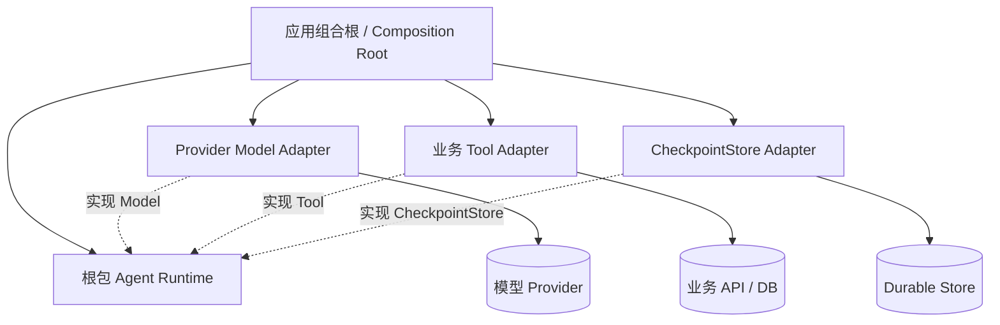
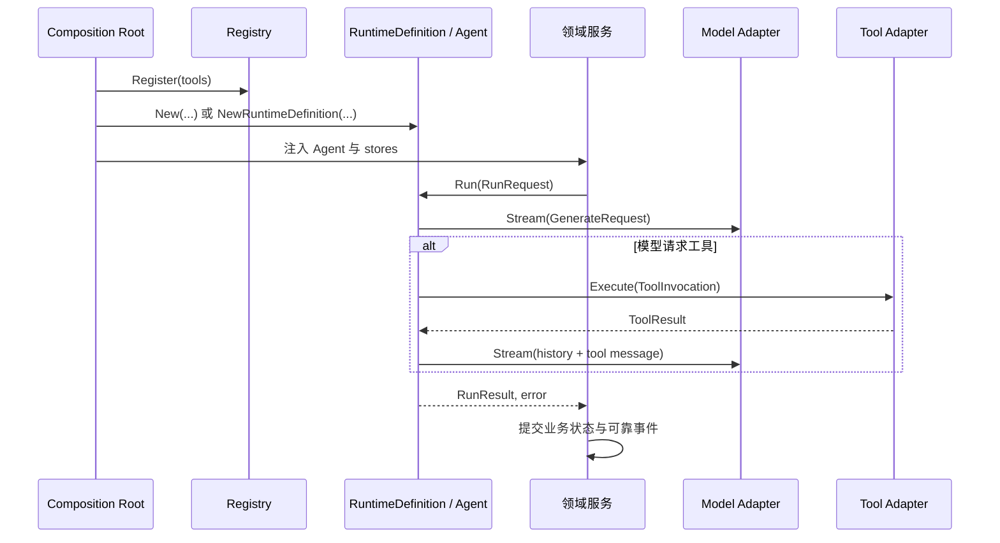
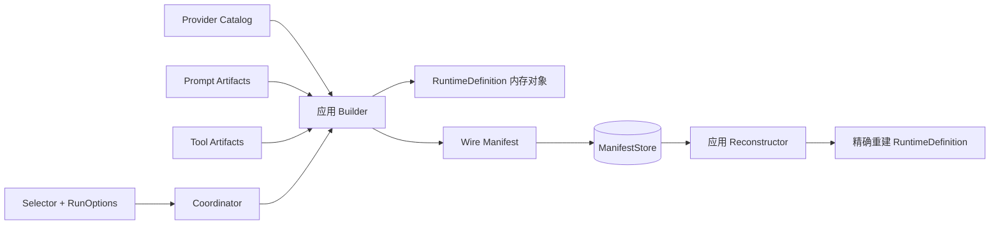
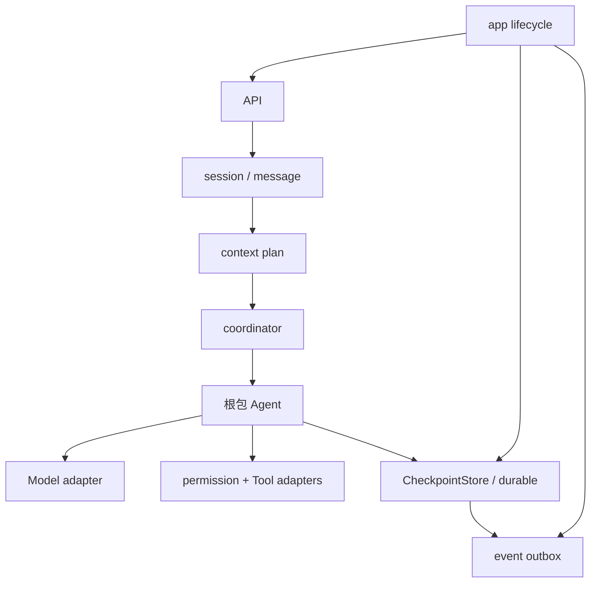

# 架构：端口、适配器与组合

## 依赖倒置

根包定义执行所需的抽象，具体基础设施反向实现这些抽象：

- `Model` 隔离 provider SDK 和 wire protocol。
- `Tool` 隔离业务能力、外部 API 和副作用实现。
- `CheckpointStore` 隔离 durable 数据库与事务实现。
- `StepPolicy` 允许应用纯函数式选择下一步 model、采样参数和活跃工具。

根包本身不导入仓库子包。`deps_test.go` 对这一规则做了自动检查，因此依赖方向是源码约束，不只是文档约定。

虚线箭头表示实现根包定义的端口。运行时只知道接口，不知道 SDK、HTTP、SQL 或领域实体。

## Composition Root

应用启动层应完成以下装配，而不是让运行时自己读取全局配置：

1. 从安全配置解析 provider、凭据和模型标识。
2. 构造实现 `Model` 的 adapter，并准确声明 `Capabilities`。
3. 构造业务工具，注册到 `Registry`，用 `AllowedTools` 建立 Agent 专属快照。
4. 选择直接 `agent.New`，或先创建带 artifact version 的 `RuntimeDefinition`。
5. 按部署需求注入 Observation、StepPolicy 或 DurableRunConfig。
6. 在领域服务中负责输入消息、终态事务、可靠事件和对外错误映射。

## 不可变组合

### ToolSet 快照

`Registry` 可以并发注册或替换工具，但 `NewToolSet` 会复制注册项并生成稳定 digest。已有 Agent 不会看到后续 Registry 修改。这避免一轮运行或一次恢复在不知情的情况下换掉工具定义。

`Strict: true` 会在 object schema 未显式设置 `additionalProperties` 时递归补为 `false`。外部 `$ref` 不被支持；schema 在注册时按 JSON Schema Draft 2020-12 编译，错误会使装配失败。

### RuntimeDefinition

`NewRuntimeDefinition` 校验 model metadata 与 `model.Capabilities()` 完全一致，快照执行设置和工具集合，并计算 definition/model/tools/prompt/policy 版本。它不序列化可执行接口；`coordinator` 的 manifest 只持久化可验证的数据引用，由应用拥有的 `Reconstructor` 精确恢复可执行对象。

## 领域事务边界

普通运行不做业务持久化。调用方获得 `RunResult` 后，可以在自己的事务中追加消息、usage 和终态事件。

durable 运行在每个外部操作前后保存运行检查点，但默认不会猜测领域表如何提交：

- 完成时通常返回 `DurableCompletion{Guard, Checkpoint}`。
- 永久失败可返回 `DurableFailure`。
- 配置延迟失败收尾时，可返回 `DurableSuspension`。
- 领域 owner 应使用其 transaction-scoped store helper，把运行终态与产品记录原子提交。
- `AutoComplete` 适合不需要与领域记录同事务收尾的场景；启用后运行时直接调用 store 的 `Complete`。

这种设计避免“checkpoint 已完成但业务消息未提交”或相反的双写裂缝。根接口规定原子状态转换，但具体 SQL transaction helper 属于 adapter/领域层。

## 子包如何组合

子包是能力模块，不是必须全部启用的层级框架。例如完整服务可能这样组合：

这只是可行组合，不是根包强制调用链。小型服务可以只保留 `API → Agent → adapters`。

## 设计适配器的原则

- Model adapter 在进入根包前完成 provider 分片聚合；根包不理解 provider-specific delta。
- Tool adapter 把权限、租户和业务事务显式组合；不要依赖包级全局变量。
- `ToolResult.IsError` 只用于希望模型理解并修正的业务失败；基础设施失败使用 Go error。
- durable tool 使用 `ToolInvocation.ExecutionKey` 作为幂等键或查询键；仅声明 `ReplayPolicyIdempotent` 并不能让不幂等系统变得安全。
- Observation consumer 不得阻塞执行链；需要可靠性时转为事务内 event/outbox。
- 所有输入、模型能力、tool choice 和持久快照版本都应在副作用前验证。

下一章：[实现原理：运行循环与 Durable 边界](05-runtime-internals.md)。
