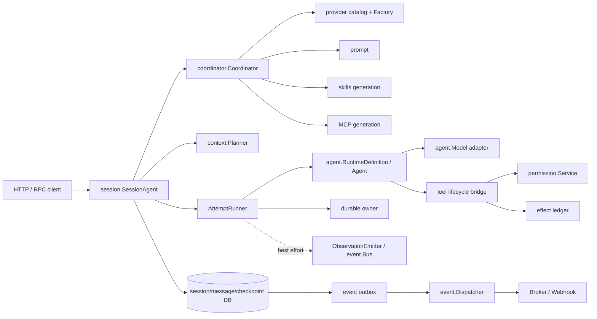
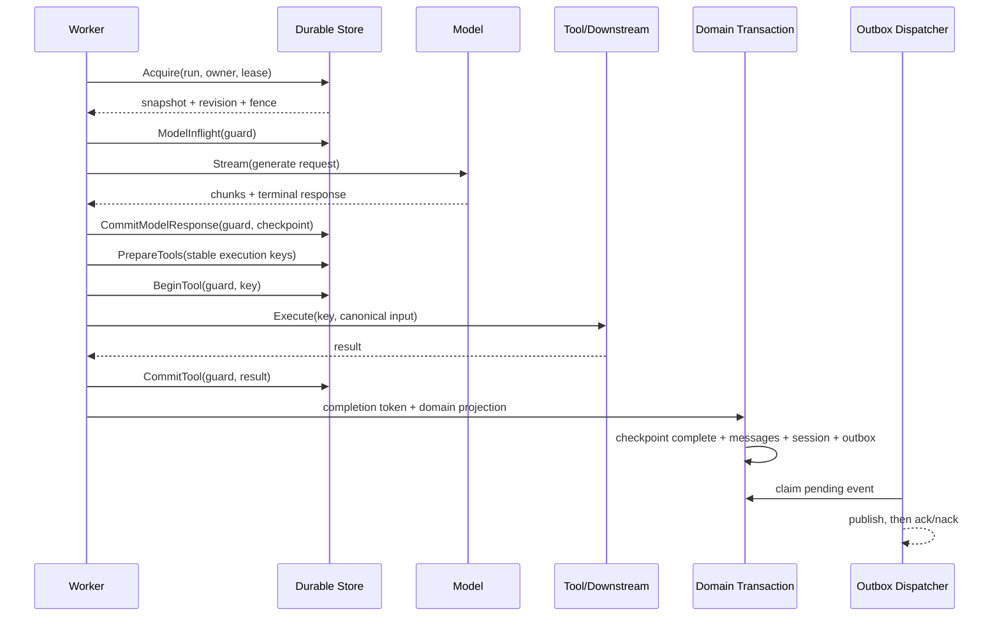
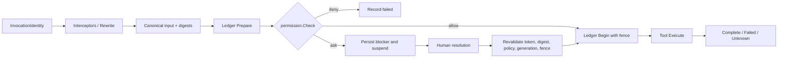

# 生产组合模式

生产系统应把仓库看成一组边界清晰的 ports，而不是一个自动提供 exactly-once、权限和事务的黑盒。根包负责确定性的 model/tool 循环；应用负责 tenant、generation、session、durable ownership、数据库事务、provider credential 和外部副作用。

## 推荐拓扑



推荐请求路径：

1. API 层验证 tenant、principal、stable request ID，并调用 `session.SessionAgent.Run`。
2. session host 解析并固定 runtime generation，创建 branch/admission 和 durable run 初态后才返回 receipt。
3. worker 从固定 session revision 生成 `context.Plan`，按 plan/definition digest 恢复同一执行输入。
4. attempt runner 获取 lease/fence，调用根包 `Agent.Run` 或生产工具 executor。
5. 最终 checkpoint、session/message 投影和 outbox 在 owning 数据库事务中完成。
6. dispatcher 在事务外重试投递；客户端以 authoritative snapshot + replay cursor 对账。

## 不变量优先的存储设计

不要按 package 名机械拆成多个数据库。事务边界应跟随业务不变量：

- admission 与 durable begin 必须一起成功，避免“已排队但不可恢复”。
- tool effect 的 prepared/running/result 与 run fence 必须由同一权威 owner 校验。
- completed checkpoint 与 session/message 最终投影必须原子提交。
- domain/session terminal event 必须与聚合变更在同一事务写 outbox。
- permission ask 与 run suspension/blocker 必须原子关联，避免审批存在但 run 继续执行。

一个物理 PostgreSQL adapter 可以同时实现多个 port，但每个写入口仍应明确唯一 owner。不要分别调用 `session.Memory`、`message.Memory` 和 `event.MemoryStore` 后声称它们构成事务。



## 固定 Runtime Generation

普通 demo 可以直接 `agent.New`；生产恢复更适合 `provider -> coordinator -> RuntimeDefinition`：

- provider catalog 固定 provider/model/version/capabilities/defaults/pricing version。
- prompt 固定 template version。
- root tool set 固定 definition、replay policy 和 executable version digest。
- skills/MCP 固定 tenant-scoped generation 和 artifact digest。
- coordinator manifest 只存 values，不存 interface 或 Go 函数。
- resume 使用 `ResolveGeneration`，绝不使用当前 generation 冒充历史 generation。

```go
maxTokens := 2048
resolved, err := coord.Resolve(ctx, coordinator.ResolveRequest{
	Selector: coordinator.Selector{
		AgentKey: "support",
		TenantKey: tenant,
		Values: []coordinator.SelectorValue{{Key: "region", Value: "eu"}},
	},
	ModelRole: provider.RolePrimary,
	RunOptions: agent.GenerationOptions{MaxTokens: &maxTokens},
})
if err != nil {
	return err
}
versions := resolved.Definition.ArtifactVersions()
if versions.Definition != resolved.DefinitionDigest {
	return errors.New("definition digest drift")
}
runner, err := resolved.Definition.NewAgent()
```

`ExecutionSettings.StopConditions` 是函数，不能进入 manifest。若生产策略需要自定义停止条件，应将策略实现注册在应用的 versioned registry，以 `PolicyVersion` 精确重建。

## Provider Adapter 模式

### 职责分层

`provider.Factory` 负责根据 catalog descriptor 和 tenant scope 创建 adapter；具体 adapter 实现根包 `agent.Model`：

- 将 canonical message/parts 转成厂商协议，保持 part 顺序。
- 将完整工具 schema 和显式 tool choice 转成上游字段。
- 拼接上游 tool argument delta，只有完整调用才发 `ChunkToolCall`。
- 发送一个且仅一个 `ChunkFinish`，并关闭 channel。
- 归一化 usage；保留 cache 和 reasoning 分类。
- 用 `NewModelError` 分类 rejected/auth/rate-limit/transport/protocol，安全 detail 不泄漏 credential 或原始敏感 payload。
- cancellation 必须取消 HTTP request/stream reader，不能遗留 goroutine。

### Adapter 骨架

```go
type vendorModel struct {
	client *Client
	name   string
	caps   agent.Capabilities
}

func (m *vendorModel) Name() string                       { return "vendor" }
func (m *vendorModel) Capabilities() agent.Capabilities   { return m.caps }

func (m *vendorModel) Stream(ctx context.Context, req *agent.GenerateRequest) (<-chan agent.StreamChunk, error) {
	if err := agent.ValidateGenerateRequestCapabilities(req, m.caps); err != nil {
		return nil, agent.NewModelError(agent.ModelErrorKindRejected, false, 400, 0, "unsupported request", err)
	}
	upstream, err := m.client.OpenStream(ctx, encodeVendorRequest(req))
	if err != nil {
		return nil, classifyVendorError(err)
	}
	out := make(chan agent.StreamChunk, 16)
	go func() {
		defer close(out)
		defer upstream.Close()
		if err := translateStream(ctx, upstream, out); err != nil {
			select {
			case out <- agent.StreamChunk{Type: agent.ChunkError, Err: classifyVendorError(err)}:
			case <-ctx.Done():
			}
		}
	}()
	return out, nil
}
```

`translateStream` 必须缓存文本和按上游 index/content-block 缓存工具参数，构造的 terminal `Response.Message` 与已发增量完全相等。adapter 上线门槛至少包括：

```go
func TestVendor(t *testing.T) {
	agenttest.TestModel(t, func(t *testing.T, c agenttest.ModelCase) agent.Model {
		return newVendorFixture(t, c)
	})
}
```

不要根据上游实际返回动态修改 `Capabilities()`；capability 是 generation identity 的一部分，漂移必须发布新 catalog generation。

## 工具与权限桥接

生产工具有两个层次：

- 根包 `agent.ToolSet` 是 runner 的模型工具循环和 schema 边界。
- 子包 `tool.Executor` 是副作用边界，包含 interceptor、canonical input、permission、fence 和 ledger。

可采用两种模式，但不能让两套 ledger 同时声称拥有同一 effect：

1. 简单模式：根包直接执行 `agent.Tool`，使用根包 `CheckpointStore` 的 `ToolExecution`。适合少量、已经在下游按 `ToolInvocation.ExecutionKey` 去重的工具。
2. 完整模式：attempt runner 驱动 `tool.Executor`，并把其结果回填执行循环；`tool.ExecutionLedger` 适配到唯一 durable effect owner。适合审批、rewrite、精细权限和审计。

权限必须针对 rewrite 后的 `PreparedExecution`。`tool.Executor` 已按此顺序实现：prepare -> preflight/rewrite -> freeze/digest -> ledger prepare -> authorize -> ledger begin -> execute -> complete。



### Fence bridge

`permission.FenceValidator` 刻意不 import `durable`。应用 adapter 将 permission 的 opaque refs 映射到 durable owner，并比较当前 attempt/fence：

```go
type fenceBridge struct{ runs RunAuthority }

func (b fenceBridge) ValidateFence(
	ctx context.Context,
	tenant permission.TenantKey,
	run permission.RunRef,
	attempt permission.AttemptRef,
	fence uint64,
) error {
	current, err := b.runs.LoadAttempt(ctx, agent.TenantKey(tenant), string(run))
	if err != nil {
		return err
	}
	if current.AttemptKey != string(attempt) || current.FenceToken != fence {
		return permission.ErrStaleFence
	}
	return nil
}
```

### 幂等与 unknown

工具必须明确 `ReplayPolicy` 和生产 `tool.Metadata.Idempotency`：

- `ReplayPolicyIdempotent` 只在下游真正按相同 execution key 去重时成立。
- context cancellation、panic、网络写后断开、effect 已发生但 ledger complete 失败，都应归类 unknown。
- unknown 不自动重放；如果工具可查询外部状态，实现 resolve/reconcile 工作流。
- permission deny 可以安全记录 failed，因为 effect 尚未越过 `ledger.Begin`。

## 事件可靠性

把进度和可靠事件彻底分开：

| 类型 | 通道 | 保证 | 用途 |
|---|---|---|---|
| token/tool/step observation | `ObservationEmitter` 或 `event.Bus` | 有界、非阻塞、可丢 | UI 动画、调试、指标 |
| session snapshot event | `event.Store` | 持久化、at-least-once delivery | 客户端状态刷新 |
| terminal/domain event | 业务事务内 outbox | 与聚合原子、at-least-once delivery | 工作流、计费、集成 |

生产 adapter 的 `AppendBatch` 应在 owning aggregate transaction 内执行。dispatcher 只负责 claim/publish/ack/nack，不应该重新推导业务事件。

```go
dispatcher, err := event.NewDispatcher(store, publisher, event.DispatcherConfig{
	TenantKey: tenant,
	Owner: "outbox-worker-a",
	BatchSize: 100,
	LeaseDuration: 30 * time.Second,
	BaseBackoff: 5 * time.Second,
	MaxBackoff: time.Minute,
	MaxAttempts: 20,
})
if err != nil { return err }

for ctx.Err() == nil {
	stats, err := dispatcher.RunOnce(ctx)
	if err != nil {
		log.Printf("dispatch: %v", err)
	}
	if stats.Claimed == 0 {
		time.Sleep(250 * time.Millisecond)
	}
}
```

consumer 必须按 `EventID` 持久化去重，并与其业务写在同一事务。SDK `event.Inbox` 是进程内参考，重启后会忘记已消费 ID。replay 返回 `Gap` 或 `Reset` 时，先取 authoritative cumulative snapshot，再从给定 cursor 继续，不能忽略缺口。

## State 与 Durable

### 选择一套 durable 主路径

根包和子包有两套 durable：

- `agent.CheckpointStore`：最接近 `Agent.Run`，接口细化到模型/工具 checkpoint，适合直接给根包 runner 增加恢复。
- `durable.Store + ExecutionLedger + UsageLedger`：面向 session/app 宿主，提供 scan、renew/release/revoke、独立 effect/usage 和 reconcile。

两者可通过应用 adapter 组合，但不能简单类型转换。若同时使用，必须规定：

- 哪个 store 分配 fence 和 revision。
- 哪个 effect ledger 是唯一事实来源。
- 根包 guard 如何映射到生产 guard。
- complete/suspend/fail 如何与 session branch、messages、outbox 原子提交。

通常服务化生产系统选子包 `durable` 为权威 owner，再由 `AttemptRunner` 适配根包执行；直接嵌入式系统可只实现 `agent.CheckpointStore`。

### Completion transaction

根包 durable runner 在 `AutoComplete: false` 时返回 capability-like 的 `DurableCompletion`。它不是“已经完成”，而是携带最新 guard/checkpoint 的完成授权。正确模式：

```go
result, err := runner.Run(ctx, request)
if err != nil {
	return classifyAttemptFailure(err, result)
}
if result.Outcome == agent.OutcomeCompleted && result.DurableCompletion != nil {
	return db.WithTx(ctx, func(tx Tx) error {
		if err := checkpoints.CompleteInTransaction(tx, *result.DurableCompletion); err != nil {
			return err
		}
		if err := messages.ProjectRunInTransaction(tx, result); err != nil {
			return err
		}
		if err := sessions.FastForwardInTransaction(tx, result); err != nil {
			return err
		}
		return outbox.AppendInTransaction(tx, terminalEvent(result))
	})
}
```

以上 `CompleteInTransaction` 等函数是应用 adapter 应提供的事务 helper，不是 SDK 现有符号。接口方法逐个调用无法跨 owner 自动获得原子性。

### Lease、fence 与恢复

- lease expiry 只允许新 worker acquire，不授权旧 worker继续写。
- 每次 acquire/revoke 推进 fence；每次 mutation 比较 owner+fence+revision。
- DB 条件更新影响 0 行时返回 conflict 并 reload，不在旧 guard 上循环重试。
- model inflight 崩溃会重复模型调用；不要把模型生成宣称为 exactly-once。
- running tool 被 revoke 时必须标 unknown，除非已证明可按 execution key 安全重放。
- shutdown 先关 admission，再 drain/cancel/checkpoint/revoke/wait，最后 flush events 和 close components。

## Session、Context 与消息状态

`session.SessionAgent` 应作为长期运行请求的入口，而不是把 HTTP context 直接传到后台 attempt：`Run` 持久化 receipt 后，worker独立推进。推荐固定以下 identity：

- tenant key 和 stable request ID。
- session base revision 与 branch key/version。
- definition/manifest digest。
- context plan key/digest、tokenizer ID 和 budget。
- step policy artifact/digest。
- durable input/config digest。

`context.Plan` 是固定 revision 的 provider 输入，不是动态 view。若 session 在执行期间新增消息，当前 attempt 不应偷偷读取；让 branch merge 处理并发。tool call/result exchange 必须成组保留，压缩不能截断半个 exchange。

`message.Snapshot` 是累计值，streaming 保存时使用 expected revision + attempt + fence，并完整替换 parts。对外展示应以 `ListVisible(session revision)` 或 session authoritative snapshot 为准，不能用 observation delta 拼接成权威消息。

## MCP、Skills 与 Subagent

### MCP

MCP manager 的 generation 是 live connection generation。run 开始时获取 lease，并把 generation/artifact identity 写入 coordinator manifest。reload 后旧 generation 只有在 lease 未释放时继续存在；进程重启 exact restoration 需要应用重建同一配置和能力，不能只存一个进程内指针。

MCP 工具结果应执行大小限制、内容类型过滤和敏感数据处理。把 MCP descriptor 转成 `agent.ToolDefinition` 不等于获得权限；仍需纳入 production tool/permission 层。

### Skills

skill instructions 永远是不可信输入，即使 trust 为 platform，也不应把内容当代码执行。`ToolRequirements` 仅用于能力校验，不能自动扩大 `ToolSet` 或 grant。run 使用 generation lease，审计记录 descriptor/content digest。

### Subagent

child run 必须拥有独立 run/attempt/fence 和预算。spawn 的 relationship、父 blocker、预算 reservation 应在一个事务中；child terminal 先提交 wake intent，再异步幂等唤醒 parent。父取消要有遍历上限，并尊重 suspend/abandon 的状态优先级。

## 测试策略

### 单元与合约测试

- 每个 provider adapter 运行 `agenttest.TestModel`，覆盖流终态、usage、错误分类和 cancellation。
- 每个工具运行 `agenttest.TestTool`，另测 schema 边界、execution key 去重、panic 和 timeout。
- 每个数据库 adapter 复用内存实现测试表达的 CAS、deep copy、tenant isolation 和 idempotency 语义。
- prompt、tool generation、manifest、context plan 和 snapshot 做 golden digest/wire round-trip 测试。

### Crash-point 测试

至少注入这些故障点：

1. `ModelInflight` 后、上游响应前进程退出。
2. 模型响应收到后、`CommitModelResponse` 前退出。
3. effect ledger `Begin` 后、外部调用前退出。
4. 外部 effect 成功后、ledger `Complete` 前退出。
5. checkpoint finalizing 后、领域事务 commit 前退出。
6. outbox publish 成功后、ack 前退出。
7. permission ask 保存后、suspend 投影前失败。
8. child terminal commit 后、parent wake 前退出。

断言不是“调用仅一次”，而是状态符合协议：安全步骤可重试，模糊 effect 进入 unknown，重复 event/usage/request 不产生重复领域效果。

### 并发与隔离

- 两个 worker 争抢同一 run，只有一个 fence 可写。
- lease 过期后旧 worker 的每个 mutation 都失败。
- 同一 session 两个 branch fast-forward 只有一个成功。
- 同一 execution key 并发执行只有一个越过 effect boundary。
- tenant A 的 key 即使与 tenant B 同名也不能交叉读取。
- shutdown 与 admission/report/reload 并发时保持线性化。

### 仓库验证

```bash
go test ./... -count=1
go vet ./...
```

对真实 adapter 还应运行 race、integration 和故障注入测试；涉及数据库时在支持的环境中执行 `go test -race ./...`，并验证真实隔离级别和唯一约束，而不只测试 mock。

## 上线检查表

### Runtime 与 Artifact

- 固定 Go module version，不依赖浮动分支。
- 每个 run 保存 definition、manifest、model、prompt、policy、tool、skills、MCP、tokenizer generation/digest。
- 恢复只按 exact generation，不回退到 current。
- 所有 durable tool 实现声明非空 executable version。
- capability 与真实 adapter 及 catalog descriptor 完全一致。

### Provider

- 通过 `agenttest.TestModel` 和真实 cancellation/timeout 测试。
- 流严格有唯一 terminal，terminal 与所有增量一致。
- usage 归一化、价格 version 和成本计算可追踪。
- retry 只针对 `ModelError.Retryable`，尊重 `RetryAfter`，并有总 attempt budget。
- 日志和错误不包含 API key、原始敏感 prompt 或 unsafe provider detail。

### Tool 与 Permission

- 每个工具声明 effect class、replay/idempotency、timeout、输入/输出限制和 concurrency。
- 下游真正使用 execution key 去重后才声明 idempotent。
- permission 在 rewrite/canonicalization 后执行。
- ask、resolve、resume 均绑定 tenant、attempt、fence、input digest、policy 和 tool generation。
- unknown effect 有 reconcile 或人工处理队列，禁止自动重放。
- sandbox/confinement 是应用责任；本仓库不提供完整 OS 隔离。

### State 与 Durable

- 所有 persisted operation 都带 tenant scope，数据库唯一键包含 tenant 或使用全局不透明键。
- admission+begin、completion+projection+outbox、approval+suspension 具有所需原子性。
- guard 在同一 SQL statement/transaction 比较 owner、revision、fence。
- lease renew、revoke、scan/reconcile worker 已部署并有告警。
- snapshot schema 未知时拒绝恢复，并有显式迁移/回滚流程。
- 备份恢复演练覆盖 manifest/artifact retention pin，不只覆盖主 session 表。

### Event 与可观测性

- 可靠事件走 outbox；Observation 仅作 best-effort UI/metrics。
- publisher、consumer 和 webhook 目标按 EventID 幂等。
- dead-letter、attempt、lease age、replay gap 和 reconciliation 有监控。
- 客户端能在 gap/reset 后获取 authoritative snapshot。
- shutdown 在 producer settle 后 flush outbox，再关闭 transport。

### Session 与容量

- admission 有 global/tenant/session active 和 queued 上限。
- context budget 使用准确 tokenizer，并计入 tool schema/media/reserved output。
- suspended、merge-pending、unknown、approval-pending 都有恢复入口和 SLA。
- subagent depth、fanout、token、cost、tool call 和 runtime budget 全部有限。
- MCP connect/call timeout、结果大小和 secret reference 均受控。

### 发布与回滚

- 新旧 worker 能识别当前持久化 schema；不兼容版本先迁移再发布。
- 旧 generation 在所有 run/pin 释放前不可删除。
- 回滚 binary 仍能加载其声称支持的 snapshot/manifest；否则停止 admission 而不是猜测执行。
- readiness 验证 required provider/catalog/store/MCP generation，liveness 不因单个 optional component 降级而误杀进程。
- shutdown budget 与平台 termination grace period 对齐，并为最后的 event flush/DB close 留出余量。

生产目标不是声称 exactly-once，而是让每个模糊窗口都有明确状态、稳定身份、可证明的重试规则和可操作的恢复路径。
