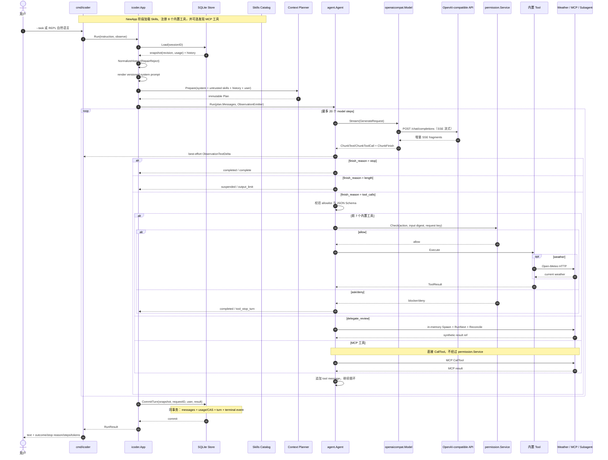

# iCoder 端到端教程

[`demo/icoder`](../demo/icoder/README.md) 是一个可运行的 Code Agent reference application。它把根包的 model/tool loop 与 Prompt、Context、Skills、Permission、MCP、Sub-Agent 和 SQLite 组合在一个独立 Go module 中。本篇按源码实际行为说明如何运行、观察和扩展它。

## 目录与路径

```text
agent-runtime-go/
├── go.mod                         # runtime 主 module
├── docs/
│   ├── 09-icoder-tutorial.md
│   └── 10-reference.md
└── demo/icoder/                   # 独立 Go module
    ├── go.mod                     # replace runtime => ../..
    ├── README.md
    ├── cmd/icoder/
    │   ├── main.go                # flags、单任务和 REPL
    │   └── main_test.go
    ├── internal/icoder/
    │   ├── app.go                 # composition root、Prompt、Context、Skills
    │   ├── capabilities.go        # MCP bridge、delegate_review
    │   ├── config.go              # 环境变量和默认值
    │   ├── store.go               # SQLite schema 和 turn 事务
    │   ├── tools.go               # 本地工具及 permission bridge
    │   ├── weather.go             # Open-Meteo adapter
    │   └── workspace.go           # 路径约束、文件和命令
    └── skills/
        ├── code-review/SKILL.md
        └── go-code-review/SKILL.md
```

以下命令默认先执行：

```bash
cd demo/icoder
```

此时各路径的准确含义是：

| 参数 | 从 `demo/icoder` 出发 | 指向 |
|---|---:|---|
| `--workspace ../..` | 上两级 | `agent-runtime-go` 仓库根 |
| `--workspace ../../..` | 上三级 | 仓库父目录 `open-source` |
| `--skills ./skills` | 当前 module 内 | demo 自带 Skills |

不要把 `../../../..` 当作仓库根：从 `demo/icoder` 出发它会再多退一级。`go.mod` 中的 `replace github.com/iceymoss/agent-runtime-go => ../..` 也印证了仓库根是 `../..`。

## 前置条件

- Go 1.25 或更高版本；主 module 和 demo module 的 `go.mod` 都声明 `go 1.25.0`。
- C 编译器和 CGO。SQLite driver 是 `github.com/mattn/go-sqlite3`，必须启用 CGO；常见 Linux 环境需安装 `gcc` 或兼容工具链，并确保 `CGO_ENABLED=1`。
- 一个实现 OpenAI Chat Completions、支持 function/tool calling 的兼容 endpoint。
- endpoint API key、base URL 和模型 ID。
- 使用 `get_weather` 或远程 MCP 时，需要对应的网络出口。

先检查环境：

```bash
go version
go env CGO_ENABLED CC
```

若 `CGO_ENABLED=0`，构建 SQLite 相关代码不会得到可用结果。可在具备 C 编译器的环境中显式执行：

```bash
CGO_ENABLED=1 go test ./... -count=1
```

## 配置

三个环境变量是必需项，flag 可覆盖 base URL 和 model，但 CLI 没有 API key flag：

```bash
export ICODER_API_KEY='your-key'
export ICODER_BASE_URL='https://api.example.com/v1'
export ICODER_MODEL='your-model'
```

| 配置 | 来源 | 默认值或行为 |
|---|---|---|
| API key | `ICODER_API_KEY` | 必填 |
| base URL | `--base-url` 或 `ICODER_BASE_URL` | 必填；请求发送到 `<base-url>/chat/completions` |
| model | `--model` 或 `ICODER_MODEL` | 必填 |
| workspace | `--workspace` | `.`，启动时转绝对路径并解析根目录 symlink |
| SQLite | `--db` | `<workspace>/.icoder.db` |
| Skills | `--skills` | 空，不加载 Skills |
| MCP | `--mcp-url` | 空，不连接 MCP |
| session | `--session` | `crypto/rand` 生成 8 字节，编码为 16 位小写十六进制 |
| write/command | `--allow-writes` | `false` |
| context window | 代码配置 | 128000 |
| max output tokens | 代码配置 | 4096 |

SQLite 默认写入 workspace。若只想审计仓库而不在仓库根留下 `.icoder.db`，显式指定临时或用户数据路径：

```bash
--db /tmp/icoder.db
```

## 构建与测试

iCoder 是独立 module，必须在 `demo/icoder` 中验证：

```bash
go test ./... -count=1
go vet ./...
go build -o /tmp/icoder ./cmd/icoder
```

验证整个仓库需要分别验证两个 module：

```bash
# 在仓库根
go test ./... -count=1
go vet ./...

# 在 demo/icoder
go test ./... -count=1
go vet ./...
```

## 单任务运行

在 `demo/icoder` 中审计当前仓库：

```bash
go run ./cmd/icoder \
  --workspace ../.. \
  --db /tmp/icoder.db \
  --skills ./skills \
  --session sdk-review \
  --task '阅读根包的 tool loop，说明模型错误和工具错误如何传播'
```

让 workspace 覆盖整个 `open-source`，再要求模型定位本仓库：

```bash
go run ./cmd/icoder \
  --workspace ../../.. \
  --db /tmp/icoder-open-source.db \
  --skills ./skills \
  --task '找到 agent-runtime-go，列出它的 Go modules'
```

CLI 最后打印：

```text
[completed: complete, steps=2, tokens=1234]
```

`Outcome` 和 `StopReason` 的准确含义见[速查表](10-reference.md#result-semantics)。

### 模型接入

iCoder 直接使用官方适配器 [`providers/openaicompat`](../providers/openaicompat/openaicompat.go)，它默认走 SSE 流式：上游的文本增量和工具调用分片会被逐段转换为 canonical `StreamChunk`，CLI 收到 `ObservationTextDelta` 时即时打印。对 SSE 支持不完整的供应商，可以在 `app.go` 中改用 `openaicompat.WithoutStreaming()` 切换到非流式请求。

## REPL

不传 `--task`，或使用 `-i` / `--interactive`，会进入 REPL：

```bash
go run ./cmd/icoder \
  --workspace ../../.. \
  --db /tmp/icoder-repl.db \
  --skills ./skills \
  --session sdk-review \
  -i
```

示例：

```text
iCoder interactive mode. Type /help for commands.
icoder[sdk-review:.../open-source]> /pwd
/home/user/open-source
icoder[sdk-review:.../open-source]> /cd agent-runtime-go
/home/user/open-source/agent-runtime-go
icoder[sdk-review:.../agent-runtime-go]> 检查当前 module 的错误传播
```

| 命令 | host 端行为 |
|---|---|
| `/help`、`/?` | 显示帮助 |
| `/pwd` | 显示本地工具实际 cwd |
| `/cd <path>` | 在 workspace 内切换 cwd；`/cd /` 返回 workspace root |
| `/session` | 显示 active session ID |
| `/sessions` | 列出 SQLite sessions |
| `/use <id>` | 切换到已有 session，或按需创建空 session |
| `/new [id]` | 新建并切换；省略 ID 时生成随机 ID |
| `/history` | 显示当前 session 的 canonical messages 摘要 |
| `/clear` | 删除当前 session、messages、turns 和 events |
| `/events` | 回放当前 session 的 terminal events |
| `/tools` | 列出 model-visible tools |
| `/skills` | 列出已加载 capability message 的首行 |
| `/exit`、`/quit`、`/q` | 退出 |

Slash command 由 CLI host 执行，不发送给模型。自然语言“切换到 agent-runtime-go”不会改变工具 cwd，必须使用 `/cd agent-runtime-go`。cwd 只是进程内状态，重启恢复到 `--workspace` root；SQLite session 历史可通过同一个 `--session` 恢复。

也可不进入 REPL，直接回放指定 session 的 terminal events：

```bash
go run ./cmd/icoder \
  --workspace ../.. \
  --db /tmp/icoder.db \
  --session sdk-review \
  --events
```

即使只执行 `--events`，`NewApp` 仍要求三个 provider 环境变量，并会完成工具、Skills 和可选 MCP 的初始化。

## Skills

`--skills ./skills` 会用 `skills.FilesystemSource` 加载目录下每个合法 `SKILL.md`。demo 自带：

- `code-review`：通用代码审查流程。
- `go-code-review`：Go、并发、资源生命周期、持久化和测试审查流程。

加载过程固定 snapshot generation，resolve 全部 descriptor，再读取各 skill 的 instructions。每个 skill 被包装为：

```text
<untrusted-skill key="..." version="...">
...
</untrusted-skill>
```

这些消息作为 capability system messages 进入 Context Plan。它们是非可信指令，不是权限边界；skill frontmatter 中的 `tool_requirements` 也不会替代 runtime 的工具白名单或 `permission.Service`。

REPL 中用 `/skills` 检查是否加载，用 `/tools` 检查真实可见工具。启动时解析 Skills，运行中不热更新。

## 8 个内置工具

不配置 MCP 时，model-visible 工具恰好是以下 8 个：

| 工具 | 输入要点 | 行为与限制 | ReplayPolicy |
|---|---|---|---|
| `get_working_directory` | `{}` | 返回工具 cwd | `idempotent` |
| `list_files` | 可选 `limit`，1..1000 | 递归列文件，默认 200，跳过 `.git`、`node_modules` | `idempotent` |
| `read_file` | `path` | 读 workspace 内已有文件，最多 64 KiB | `idempotent` |
| `search_code` | `pattern`、可选 `limit` | 字面子串搜索，默认 50，最多 200；不是正则搜索 | `idempotent` |
| `write_file` | `path`、`content`、可选 `expected_digest` | 全量替换或创建单文件，写为 `0644`；digest 是 `sha256:<hex>` | `never` |
| `run_command` | `program`、`args`、可选 `timeout_seconds` | 只运行 allowlist 中的 Go/Git 子命令，输出最多 64 KiB | `never` |
| `get_weather` | `location`、`units` | 调用 Open-Meteo 查询当前天气 | `idempotent` |
| `delegate_review` | `task` | 运行一个内存 child workflow，返回 synthetic result ref | `idempotent` |

前 7 个工具由 `authorizedTool` 包装。读取、搜索和 weather 默认 allow；写文件和命令默认 ask。`delegate_review` 直接注册到 registry，并没有经过 `authorizedTool`；虽然策略 switch 中列出了 `subagent.spawn`，当前 bridge 没有调用该 permission action。

`run_command` 不接收 shell 字符串。允许的首个参数只有：

```text
go test | go vet | go build | go fmt
git status | git diff | git log | git show
```

后续参数仍直接传给对应程序，所以这是一层演示用 allowlist，不应被描述为完备的命令安全策略。

## 写权限 blocker

默认调用 `write_file` 或 `run_command` 时，permission policy 返回 `ask`。bridge 将它转换为模型可见的错误结果：

```text
approval required: request=<request-ref> token=<resume-token>
```

同时设置 `ToolResult.IsError=true` 和 `StopTurn=true`，因此本轮以 `Outcome=completed`、`StopReason=tool_stop_turn` 结束，副作用没有执行。

这是 blocker 演示，不是完整审批 UI 或恢复流程：permission store 在内存中；CLI 没有 approve 命令；不会持久化并恢复 prepared effect；也不会拿 token 自动继续原 turn。需要写入时只能在确认风险后，为整个进程显式启用：

```bash
go run ./cmd/icoder \
  --workspace ../.. \
  --db /tmp/icoder-write.db \
  --skills ./skills \
  --allow-writes \
  --task '修正 README 中一个明确的拼写错误，并运行最小验证'
```

`--allow-writes` 同时允许 `workspace.write` 和 `workspace.command`，不是单次审批，也不是按文件授权。

## Weather

`get_weather` 先访问 Open-Meteo geocoding API，再访问 current forecast API，不需要 Open-Meteo API key：

```bash
go run ./cmd/icoder \
  --workspace ../.. \
  --db /tmp/icoder-weather.db \
  --task '查询北京当前天气，使用摄氏度，并说明观测时间'
```

模型工具输入应为：

```json
{"location":"Beijing","units":"celsius"}
```

`units` 只能是 `celsius` 或 `fahrenheit`。天气工具由 permission policy 以 `network.read` 允许，但 HTTP client 直接访问固定公共域名；它没有接入统一代理、egress policy 或持久审计。

## MCP

只支持一个 Streamable HTTP endpoint：

```bash
go run ./cmd/icoder \
  --workspace ../.. \
  --db /tmp/icoder-mcp.db \
  --mcp-url 'https://approved-mcp.example.com/mcp' \
  --task '列出可用工具，并使用 MCP 工具完成调查'
```

启动时 manager 连接 endpoint、获取 capability snapshot，并把发现的工具注册进同一个 registry。HTTP policy 将 URL 的精确 `host[:port]` 放入 allowlist，响应和工具结果上限为 64 KiB；允许 insecure loopback。demo 不从 MCP 配置启动本地 stdio 命令。

重要边界：动态 MCP tool 的 `Execute` 直接调用 `mcp.Manager.CallTool`，没有经过 iCoder 的 `permission.Service`。`--allow-writes` 对 MCP 没有控制作用，MCP 工具是否有副作用取决于远端服务。只应连接受信 endpoint，并在生产 adapter 外另设权限、身份、egress 和审计边界。MCP generation 也不写入 demo SQLite。

## Sub-Agent

模型可调用：

```json
{"task":"独立检查 store.CommitTurn 的事务边界和并发冲突"}
```

`delegate_review` 确实使用 `subagent.Service` 的 `Spawn`、`RunNext` 和 `Reconcile`，设置 depth、fanout、token、cost、tool-call 和 runtime 限额；store、runner 和 parent waker 都是 demo 内存实现。

但 `reviewRunner` 不调用模型、不读取仓库，也不生成真实审查意见。它只根据 task bytes 计算 `review:<digest-fragment>`，估算 input token，固定返回 32 output tokens。返回给模型的内容类似：

```text
child=<run-key> state=completed result=review:0123456789abcdef
```

因此这是 **synthetic `delegate_review`**，用于演示 child run 生命周期与预算接口，不是独立 reviewer agent。进程重启后 child 状态丢失，wake recorder 也不会恢复 parent Agent。

## SQLite schema 与事务

SQLite 由 `github.com/mattn/go-sqlite3` 提供，因此需要 CGO。默认 DSN 开启 10 秒 busy timeout 和 foreign keys，并将连接池限制为单连接。

```sql
CREATE TABLE icoder_sessions (
    id TEXT PRIMARY KEY,
    revision INTEGER NOT NULL DEFAULT 0,
    prompt_tokens INTEGER NOT NULL DEFAULT 0,
    completion_tokens INTEGER NOT NULL DEFAULT 0,
    total_tokens INTEGER NOT NULL DEFAULT 0,
    created_at TEXT NOT NULL,
    updated_at TEXT NOT NULL
);

CREATE TABLE icoder_messages (
    session_id TEXT NOT NULL,
    ordinal INTEGER NOT NULL,
    payload TEXT NOT NULL,
    created_at TEXT NOT NULL,
    PRIMARY KEY (session_id, ordinal),
    FOREIGN KEY (session_id) REFERENCES icoder_sessions(id)
);

CREATE TABLE icoder_turns (
    session_id TEXT NOT NULL,
    request_id TEXT NOT NULL,
    input_digest TEXT NOT NULL,
    result_payload TEXT NOT NULL,
    PRIMARY KEY (session_id, request_id),
    FOREIGN KEY (session_id) REFERENCES icoder_sessions(id)
);

CREATE TABLE icoder_events (
    session_id TEXT NOT NULL,
    sequence INTEGER NOT NULL,
    event_id TEXT NOT NULL UNIQUE,
    event_type TEXT NOT NULL,
    payload TEXT NOT NULL,
    occurred_at TEXT NOT NULL,
    PRIMARY KEY (session_id, sequence),
    FOREIGN KEY (session_id) REFERENCES icoder_sessions(id)
);
```

`CommitTurn` 在一个数据库事务中完成：

1. 按 `(session_id, request_id)` 检查幂等；相同 ID 但 input/result 不同则冲突。
2. 计算下一条 message ordinal。
3. 追加本轮 user message 和 `RunResult.Messages`。
4. 用 `WHERE revision = snapshot.Revision` 做 session revision CAS，并累加 usage。
5. 写入 turn result snapshot。
6. 写入一个 `agent.run.terminal` terminal event，sequence 等于新 revision。
7. commit；任一步失败则 rollback。

模型请求、weather/MCP 网络请求、subagent 执行、文件写入和命令执行都发生在 SQLite 事务之外。事务保证 demo 自己的 session 聚合原子发布，不保证外部副作用 exactly-once。若 Agent run 返回 Go error，`App.Run` 不调用 `CommitTurn`，失败 run 也不会落到这四张表。

这不是 `session.SessionAgent` host，也没有使用根包 durable checkpoint；它是单进程、乐观 revision CAS 的 demo-owned store。

## 完整请求时序

下图覆盖一次可能包含 tool call 的完整请求；虚线分支按实际配置发生：



Observation 是容量 64 的 best-effort 非阻塞通知，不是权威事件日志；权威 terminal event 是 `CommitTurn` 时与 session 更新同事务写入 SQLite 的记录。

## 安全与可靠性边界

- Workspace confinement 通过绝对路径、`EvalSymlinks` 和 `filepath.Rel` 检查实现，不是 OS sandbox。
- 工具和命令以启动 iCoder 的同一 OS 用户运行，继承进程环境变量；没有容器、seccomp、chroot、mount namespace 或资源隔离。
- 路径检查与实际读写之间仍可能出现 TOCTOU；不要把 workspace 检查当作恶意本地用户隔离。
- `read_file` 不验证 UTF-8，虽然 tool description 声称读取 UTF-8 text；二进制内容会按 Go string 返回并截断。
- provider 是非真实 streaming；byte counter 是约每 4 bytes 一个 token 的保守估算，不是模型 tokenizer。
- permission approval、subagent store、Context plan store 都是内存实现。
- MCP 不经过 permission，MCP generation 不持久化。
- SQLite 只保存成功返回并完成 commit 的 turn，不是完整 durable execution ledger。

## 如何继续扩展

按边界逐项替换，不要把策略塞进 runtime Core：

1. 实现生产 `agent.Model` adapter：消费 SSE/供应商原生流，正确聚合 tool-call arguments，归一化 usage 和 `ModelError`，并通过 adapter conformance tests。
2. 将 `Config` 扩展为明确的 credential/provider 配置，但避免由根包读取环境变量。
3. 为 workspace 工具增加 OS 级隔离：临时 checkout、容器或受限 worker、CPU/内存/网络限制和专用低权限身份。
4. 将写操作改为 prepare/approve/resume：持久化 permission store、opaque blocker 和 durable checkpoint，恢复时重新校验 input digest、policy generation 和 fence。
5. 对所有 effect tool 使用统一的 `tool.Executor`/permission interceptor，包括 MCP 和 subagent spawn；不要依赖 Prompt 或 Skills 声明权限。
6. 将 `reviewRunner` 替换为真实 child Agent facade，并使用持久 subagent store、真实 parent wake 和独立预算/credential。
7. 将 demo SQLite schema 迁移到应用拥有的数据库 migration；若要 worker 恢复，引入 `session`、`durable`、lease、fence 和 effect ledger，而不是只扩展 `icoder_turns`。
8. 为 Skills/MCP 保存选定 generation 和 digest，使恢复请求可检测 capability drift。
9. 增加结构化审计：记录 permission decision、工具 execution key、provider request ID、MCP server/generation 和 terminal event dispatch 状态。
10. 保留窄接口：weather、代码搜索、存储和模型均以 port 注入，使单测不依赖真实网络或模型。

包选择、返回语义和验证命令见[《速查表》](10-reference.md)。
