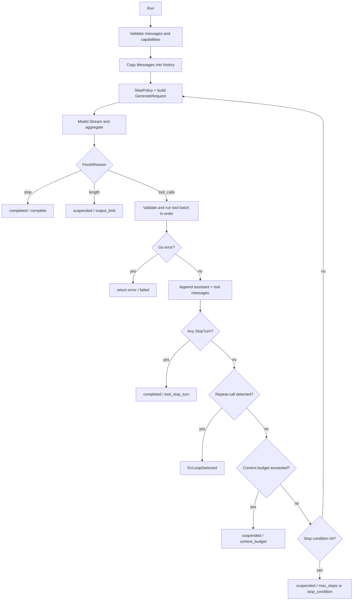
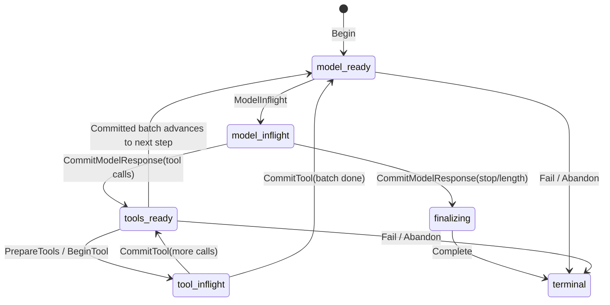

# Runtime loop internals

This document is for developers implementing `Model.Stream`, `Tool.Execute`, or `CheckpointStore`, or debugging stream, tool, stop-semantics, and recovery issues. It describes the internal protocol of root-package `Agent.Run`. For API usage see [packages/agent.md](packages/agent.md); for result enums see [reference.md](reference.md).

## Ordinary run loop

`Agent.Run` first validates request messages and model capabilities, copies Messages into a local history, then repeatedly executes model steps. Each model response must fully pass stream-protocol validation before tools may run.

Key ordering:

1. `ctx.Err()` is checked at the start of each step; `streamStep` also watches a derived context.
2. `nextRequest` applies `StepPolicy` and may only choose the next step's active tools, tool choice, model name, and three generation parameters—it cannot replace Model or mutate history.
3. After a terminal model response validates, the assistant message immediately enters the result and history.
4. `FinishStop` is legal only with no tool calls and completes immediately; `FinishLength` means output hit the provider limit—text is kept but the run returns suspended.
5. The tool batch runs in response order, not concurrently; tool results are combined into one `RoleTool` message before the next model request.
6. After tools, checks run in order: stop-turn, repeat loop, context budget, and composed stop conditions.

`MaxSteps` is always added via the default `StepCountIs(MaxSteps)` stop condition. When the limit is hit while the model is still calling tools, the result is `OutcomeSuspended`, not a Go error.

## Stream protocol

The `Model.Stream` channel is the full transport for one generation step and accepts only four chunk kinds:

| Type | Content | Constraints |
|---|---|---|
| `ChunkText` | `TextDelta` | Concatenate in arrival order and try to emit Observation |
| `ChunkToolCall` | `*ToolCall` | Must be a fully aggregated call from the provider adapter |
| `ChunkFinish` | `*Response` | Sole terminal response: full message, finish reason, usage |
| `ChunkError` | `Err` | With cause: classify/propagate; without cause: protocol error |

These produce non-retryable `ModelErrorKindProtocol`: unknown chunk type, error chunk without cause, channel closed without a terminal response, chunks after the terminal response, invalid terminal response, tool-choice violations, aggregated deltas disagreeing with the terminal message, illegal usage.

`ValidateResponse` also requires: role must be assistant; message and response finish reasons must match; `tool_calls` must include at least one call with a unique ID; other finish reasons must not carry tools; only `stop`, `tool_calls`, and `length` are accepted as complete terminals.

## Tool validation and repair budget

At registration, `Registry.Register` normalizes definitions and compiles schemas:

- Missing parameter schema becomes `{"type":"object"}`; JSON Schema Draft 2020-12 is used.
- External `$ref` is forbidden; internal `#...` refs are allowed.
- `Strict` injects `additionalProperties: false` on object schemas by default.
- Duplicate names fail; replacement requires an explicit `Replace` call.

At call time, checks run in order: name is in the current `ToolSet`; empty input becomes `{}`; input is valid JSON; top-level value is a JSON object; value passes the compiled schema.

Unavailable tools do not abort immediately—they produce a model-visible `ToolResult` with `IsError: true`, prompting the model to try another tool. JSON/schema errors likewise become error results but increment the repair count. `ToolRepairLimit` is how many illegal-argument calls are allowed: `0` means the default `1`, configurable range `0..2`; when cumulative illegal calls exceed the limit, `ErrToolInputInvalid` is returned—so by default the first illegal call is fed back for the model to repair.

After validation, `Tool.Execute` is called. Four outcomes:

- Ordinary `ToolResult`: continue the loop.
- `IsError: true`: feed back as a business-handleable result; does not consume schema repair budget.
- `StopTurn: true`: finish the current batch in order, then complete with `tool_stop_turn`.
- Non-nil Go error: abort the run immediately, keep the wrapped cause—do not disguise it as a model-repairable result.

The runtime fills `ToolCallID`, and fills the result name when the tool did not set it.

## Stop, Outcome, and errors

`StopReason` and `Outcome` are orthogonal but related result fields:

| Scenario | Outcome | StopReason | `error` |
|---|---|---|---|
| Model `FinishStop` | `completed` | `complete` | nil |
| Tool requests stop turn | `completed` | `tool_stop_turn` | nil |
| Model `FinishLength` | `suspended` | `output_limit` | nil |
| Latest input near context window | `suspended` | `context_budget` | nil |
| Hit `MaxSteps` | `suspended` | `max_steps` | nil |
| Custom stop condition | `suspended` | `stop_condition` | nil |
| Repeated tool calls hit threshold | `failed` | `loop_detected` | `ErrLoopDetected` |
| Schema repair budget exhausted | `failed` | may be empty | `ErrToolInputInvalid` |
| Model/Tool/context error | `failed` | may be empty | cause chain |

Whenever `Run` returns a non-nil error, `result.Outcome` is `failed`. Callers should check both `Outcome` and `StopReason`—do not judge completeness from `Text` alone, and do not treat every nil error as success.

Model errors use `ModelError` classification: unclassified model stream open/transport errors normalize to retryable transport errors; protocol errors are not retryable; context cancellation and deadline are preserved as-is. The durable path uses `Retryable` and context errors to decide suspend vs. permanent failure credentials.

Observation does not participate in error or terminal decisions. Emitters use `TryRLock` and non-blocking channel sends; contention or a full queue drops events. When a durable run ends, only its admission is closed; emitter lifetime is managed by the caller.

## Durable boundaries

With `DurableRunConfig` set, the runtime first computes immutable input/config digests, then `Begin` and `Acquire`. Each acquire advances the fence token; every write must compare, in one atomic operation, the `MutationGuard`'s run key, lease owner, revision, and fence token.

The diagram shows only the main `RunPhase` path. Separate `RunStatus` moves from `claimed` via `Acquire` to `running`, may become `suspended` then acquire again, or enter immutable `completed`, `failed`, or `abandoned`; terminal status must pair with `terminal` phase. Store implementations must follow legal `CheckpointStore` transitions and commit atomically inside each method; database transactions must not span external model or tool calls.

**Model boundary**: write `model_inflight` before the model call; after the full response validates, `CommitModelResponse` atomically saves response, usage, history, and next phase. If a crash happens while inflight, it is unknown whether the provider processed the request—recovery will call the model again, so model generation is at-least-once.

**Tool boundary**: before any tool side effect, stable idempotency keys are derived for all pending calls (from run identity, step, ordinal, call ID, name, and input digest); `PrepareTools` atomically creates prepared records; `BeginTool` marks a single execution before the external call; `Tool.Execute` receives the same `ExecutionKey`; `CommitTool` atomically saves result and checkpoint. If `BeginTool` finds an already completed record, it reuses the result and does not call Tool again.

If a crash happens after the external side effect but before `CommitTool`, state is unknown. Only `ReplayPolicyIdempotent` passes `safeReplay` to the store; `ReplayPolicyNever` and `ReplayPolicyResolve` on the current root run path do not auto-mark safe replay—the store may return `ErrToolExecutionUnknown` to suspend the run pending manual or external reconciliation. True effective-once still requires downstream tools to dedupe by execution key.

**Completion and domain ownership**: after a durable run accepts a terminal response and saves finalizing, the default return is `DurableCompletion`, letting the domain owner commit guard/checkpoint with message projection, product state, and reliable events together; only when `AutoComplete` is true does the runtime call `CheckpointStore.Complete` itself. Permanent runtime failures similarly may return `DurableFailure`; retryable cancel, deadline, retryable model error, or unknown tool effects usually suspend. `DeferFailureFinalization` lets the domain layer commit suspension with its own admission/product projection in one transaction.

## Upper bounds of recovery guarantees

- Checkpoints keep committed state and use revision/fence to block stale workers from writing.
- Repeated `Begin` with the same identity and digests may return the existing run; conflicting input should return `ErrCheckpointConflict`.
- Retrying a completed durable run returns the stored result without calling the provider again.
- Checkpoint schema currently accepts only version `1`; unknown versions must be migrated explicitly—never guess-read.
- Neither model nor external tool calls can be made exactly-once by this interface alone.
- The durable store guarantees run state; cross-aggregate atomicity for session, domain records, billing facts, and outbox still needs database adapters and domain transaction design.

For production composition see [production.md](production.md); for durable subpackages (lease, scan, reconcile) see [packages/durable.md](packages/durable.md).
