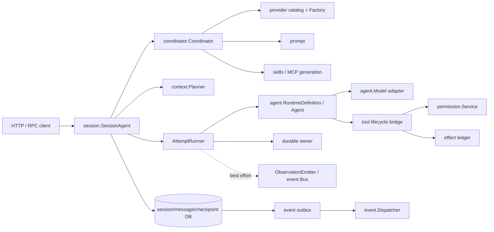

# Production composition patterns

This document is for architects and backend developers composing this library into a production service. It covers a recommended topology, a representative composition example, and a themed pattern checklist. Core principle: the repository is a set of clear ports, not a black box that auto-provides exactly-once, permissions, and transactions—the root package owns the deterministic model/tool loop; the application owns tenant, generation, session, durable ownership, database transactions, provider credentials, and external side effects.

## Recommended topology



Request path:

1. The API layer validates tenant, principal, and stable request ID, then calls `session.SessionAgent.Run`.
2. The session host resolves and pins the runtime generation, creates branch/admission and durable run initial state, then returns a receipt.
3. The worker builds a `context.Plan` from the fixed session revision and restores the same execution input by plan/definition digest.
4. The attempt runner acquires lease/fence and calls root-package `Agent.Run` or the production tool executor.
5. Final checkpoint, session/message projection, and outbox complete in the owning database transaction.
6. The dispatcher retries delivery outside the transaction; clients reconcile via authoritative snapshot + replay cursor.

## Representative composition example

Pin generation (resolve), run the attempt, and atomically commit terminal state—the three core production-path steps:

```go
// 1. 固定 runtime generation：provider/prompt/tools/skills/MCP 全部按值进入 manifest。
maxTokens := 2048
resolved, err := coord.Resolve(ctx, coordinator.ResolveRequest{
	Selector: coordinator.Selector{
		AgentKey:  "support",
		TenantKey: tenant,
		Values:    []coordinator.SelectorValue{{Key: "region", Value: "eu"}},
	},
	ModelRole:  provider.RolePrimary,
	RunOptions: agent.GenerationOptions{MaxTokens: &maxTokens},
})
if err != nil {
	return err
}
if resolved.Definition.ArtifactVersions().Definition != resolved.DefinitionDigest {
	return errors.New("definition digest drift")
}
runner, err := resolved.Definition.NewAgent()
if err != nil {
	return err
}

// 2. 执行 attempt（lease/fence 由 durable owner 管理）。
result, err := runner.Run(ctx, request)
if err != nil {
	return classifyAttemptFailure(err, result)
}

// 3. AutoComplete=false 时 DurableCompletion 是"完成授权"，不是"已完成"。
//    checkpoint 完成、消息投影、session 推进和 outbox 必须在同一领域事务中提交。
//    以下 *InTransaction 是应用 adapter 提供的事务 helper，不是 SDK 现有符号。
if result.Outcome == agent.OutcomeCompleted && result.DurableCompletion != nil {
	return db.WithTx(ctx, func(tx Tx) error {
		if err := checkpoints.CompleteInTransaction(tx, *result.DurableCompletion); err != nil {
			return err
		}
		if err := messages.ProjectRunInTransaction(tx, result); err != nil {
			return err
		}
		if err := sessions.FastForwardInTransaction(tx, result); err != nil {
			return err
		}
		return outbox.AppendInTransaction(tx, terminalEvent(result))
	})
}
```

Calling interface methods one by one does not automatically give cross-owner atomicity; transaction boundaries must come from the application database adapter.

## Pattern checklist

### Runtime generation

- Production recovery uses `provider -> coordinator -> RuntimeDefinition`, not bare `agent.New`.
- Catalog pins provider/model/version/capabilities/defaults/pricing version; prompt pins template version; tool set pins definition, replay policy, and executable version digest; skills/MCP pin tenant-scoped generation and artifact digest.
- Manifests store values only—not interfaces or Go functions; `ExecutionSettings.StopConditions` are functions and cannot enter the manifest—register custom stop conditions in the application's versioned registry and rebuild exactly via `PolicyVersion`.
- Resume uses `ResolveGeneration`; never pretend the current generation is a historical one.

### Storage and transaction invariants

Transaction boundaries follow business invariants—do not split databases mechanically by package name:

- Admission and durable begin succeed together, avoiding "queued but unrecoverable."
- Tool-effect prepared/running/result and run fence are validated by the same authoritative owner.
- Completed checkpoint and final session/message projection commit atomically.
- Terminal events and aggregate changes write the outbox in the same transaction.
- Permission ask and run suspension/blocker associate atomically.

One physical PostgreSQL adapter may implement multiple ports, but each write entry has a unique owner. Calling `session.Memory`, `message.Memory`, and `event.MemoryStore` separately does not form a transaction.

### Provider adapter

- The adapter implements root-package `agent.Model`: preserve part order, pass full tool schemas and explicit tool choice, concatenate upstream tool-argument deltas (emit `ChunkToolCall` only for complete calls), send exactly one `ChunkFinish` then close the channel.
- Terminal `Response.Message` must equal emitted deltas exactly; normalize usage and keep cache/reasoning categories.
- Use `NewModelError` to classify rejected/auth/rate-limit/transport/protocol; details must not leak credentials or sensitive payloads; cancellation must cancel the HTTP request/stream reader with no leaked goroutines.
- Ship gate: pass `agenttest.TestModel` conformance tests.
- Do not mutate `Capabilities()` based on what the upstream actually returned; capability is part of generation identity—drift must publish a new catalog generation.

### Tools and permissions

- Two layers: root-package `agent.ToolSet` is the model tool loop and schema boundary; subpackage `tool.Executor` is the side-effect boundary (interceptor, canonical input, permission, fence, ledger).
- Choose one mode—do not let two ledgers claim the same effect: simple mode runs `agent.Tool` + root `CheckpointStore` directly; full mode has the attempt runner drive `tool.Executor`, with `tool.ExecutionLedger` adapted to the sole durable effect owner (fit for approval, rewrite, audit).
- Permission must target the rewritten `PreparedExecution`; `tool.Executor` order: prepare -> preflight/rewrite -> freeze/digest -> ledger prepare -> authorize -> ledger begin -> execute -> complete.
- `permission.FenceValidator` deliberately does not import `durable`; the application adapter maps permission opaque refs to the durable owner and compares the current attempt/fence, returning `permission.ErrStaleFence` on mismatch.
- `ReplayPolicyIdempotent` holds only when downstream truly dedupes on the same execution key; cancellation, panic, disconnect after a network write, and effect done but ledger complete failed all classify as unknown; unknown does not auto-replay—implement resolve/reconcile when external state is queryable; permission deny can safely record failed (effect has not crossed `ledger.Begin`).

### Event reliability

| Type | Channel | Guarantee |
|---|---|---|
| token/tool/step observation | `ObservationEmitter` / `event.Bus` | bounded, non-blocking, droppable; UI/metrics only |
| session snapshot event | `event.Store` | durable, at-least-once delivery |
| terminal/domain event | outbox inside business transaction | atomic with aggregate, at-least-once delivery |

- `AppendBatch` runs inside the owning aggregate transaction; the dispatcher only claim/publish/ack/nack—it does not re-derive business events.
- Consumers persist dedupe by `EventID` in the same transaction as business writes; SDK `event.Inbox` is an in-process reference and forgets after restart.
- On replay `Gap` or `Reset`, take an authoritative cumulative snapshot first, then continue from the cursor—never ignore gaps.

### Durable choice and lease/fence

- Two durable stacks: `agent.CheckpointStore` sits next to `Agent.Run` for embedded direct recovery; `durable.Store + ExecutionLedger + UsageLedger` targets session/app hosts with scan, renew/release/revoke, and reconcile. Service-oriented systems usually pick subpackage `durable` as the authoritative owner, with `AttemptRunner` adapting root execution.
- When using both, define: who allocates fence/revision, which effect ledger is the sole source of truth, how the root guard maps, and how terminal state commits atomically with session/messages/outbox.
- Lease expiry only allows a new worker to acquire—it does not authorize the old worker to keep writing; each acquire/revoke advances the fence; DB conditional updates affecting 0 rows return conflict and reload.
- Model-inflight crash repeats the model call; a running tool revoked is marked unknown unless proven safe to replay by execution key.
- Shutdown order: close admission first, then drain/cancel/checkpoint/revoke/wait, finally flush events and close components.

### Session and Context

- `session.SessionAgent` is the long-lived request entry: `Run` persists a receipt, then workers advance independently—do not pass the HTTP context into background attempts.
- Each run pins: tenant key, stable request ID, session base revision, branch key/version, definition/manifest digest, context plan key/digest, tokenizer ID, budgets, step-policy digest, durable input/config digest.
- `context.Plan` is provider input at a fixed revision; messages added to the session during execution are handled by branch merge—the current attempt does not sneak-read. Tool call/result exchanges stay grouped; compression must not truncate half an exchange.
- `message.Snapshot` is cumulative; streaming saves use expected revision + attempt + fence and fully replace parts; external display uses `ListVisible(session revision)` or an authoritative snapshot—do not assemble authoritative messages from observation deltas.

### MCP, Skills, and Subagent

- MCP generation is a live connection generation: take a lease at run start and write generation/artifact identity into the manifest; exact restoration after process restart needs the application to rebuild the same config and capabilities. Cap MCP tool results by size, filter content types, and handle sensitive data; turning a descriptor into `agent.ToolDefinition` does not grant permission—still fold into the tool/permission layer.
- Skill instructions are always untrusted input; `ToolRequirements` is for capability checks only and does not auto-expand `ToolSet` or grant; audit descriptor/content digests.
- Child runs have independent run/attempt/fence and budgets; spawn relationship, parent blocker, and budget reservation share one transaction; child terminal commits wake intent first, then asynchronously and idempotently wakes the parent; parent cancel has a traversal cap.

### Testing strategy

- Contract tests: every provider adapter runs `agenttest.TestModel`, every tool runs `agenttest.TestTool`; database adapters reuse CAS, deep copy, tenant isolation, and idempotency semantics expressed by in-memory implementation tests; prompt/manifest/plan/snapshot get golden digest and wire round-trip tests.
- Crash-point injection should at least cover: after `ModelInflight` before `CommitModelResponse`, after ledger `Begin` before the external call, after a successful effect before `Complete`, after finalizing before the domain transaction, after outbox publish before ack, after ask save before suspend projection, after child terminal before parent wake. Assert not "called only once," but that state matches the protocol: safe steps may retry, ambiguous effects go unknown, duplicate event/usage/request produce no duplicate domain effects.
- Concurrency isolation: two workers racing one run—only one fence may write; after lease expiry every mutation from the old worker fails; two branch fast-forwards on one session—only one succeeds; concurrent same execution key—only one crosses the effect boundary; same-named keys across tenants do not cross.
- Repo verification: `go test ./... -count=1` and `go vet ./...`; real adapters add `-race`, integration, and fault injection to verify real isolation levels and unique constraints.

## Launch checklist

- **Artifact**: pin the Go module version; each run saves generation or digest for definition/manifest/model/prompt/policy/tool/skills/MCP/tokenizer; restore only by exact generation; durable tools declare a non-empty executable version.
- **Provider**: pass conformance and real cancellation/timeout tests; streams have a unique terminal matching deltas; retry only when `ModelError.Retryable` and respect `RetryAfter`; logs contain no API keys or sensitive prompts.
- **Tool/Permission**: each tool declares effect class, replay/idempotency, timeout, I/O limits, and concurrency; permission runs after rewrite; ask/resolve/resume bind tenant, attempt, fence, input digest, policy, and tool generation; unknown effects have a reconcile queue; sandbox is an application responsibility.
- **State/Durable**: every persisted operation is tenant-scoped; admission+begin, completion+projection+outbox, and approval+suspension meet atomicity; guards compare owner/revision/fence in one SQL statement; lease renew, revoke, and scan workers are deployed with alerts; unknown snapshot schemas refuse restore.
- **Event**: reliable events go through outbox; consumers/webhooks are idempotent by EventID; dead-letter, lease age, and replay gap are monitored; shutdown settles producers before flushing outbox.
- **Capacity**: admission has global/tenant/session caps; context budget uses an accurate tokenizer and accounts for tool schema/media/reserved output; suspended, merge-pending, unknown, and approval-pending all have recovery entry points and SLAs; subagent depth/fanout/token/cost are all bounded.
- **Release/rollback**: migrate incompatible schemas before release; old generations must not be deleted until all pins release; if a rolled-back binary cannot load a snapshot, stop admission rather than guess-execute; align shutdown budget with platform termination grace period.

The production goal is not to claim exactly-once, but to give every ambiguous window a clear state, stable identity, provable retry rules, and an operable recovery path. For run-loop protocol details see [internals.md](internals.md); for each subpackage's integration boundary see the matching docs under `packages/` (e.g. [packages/durable.md](packages/durable.md), [packages/permission.md](packages/permission.md), [packages/event.md](packages/event.md)).
