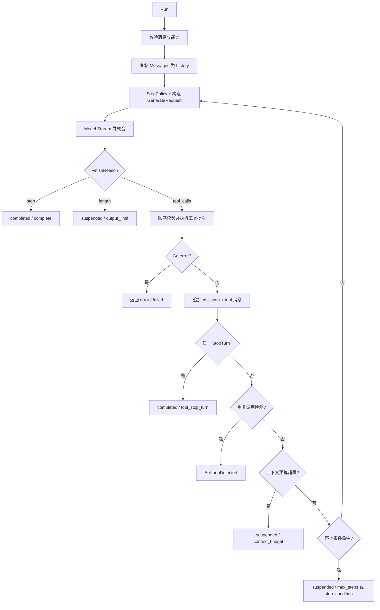
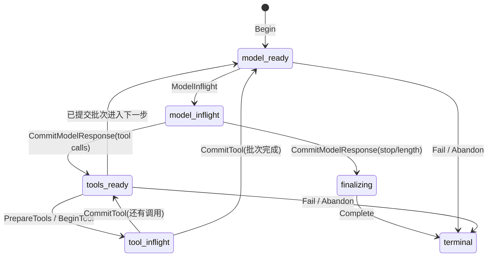

# 运行循环内部机制

本文面向实现 `Model.Stream`、`Tool.Execute`、`CheckpointStore`，或排查 stream、工具、停止语义和恢复问题的开发者，描述根包 `Agent.Run` 的内部协议。API 用法见 [packages/agent.md](packages/agent.md)，结果枚举速查见 [reference.md](reference.md)。

## 普通运行 loop

`Agent.Run` 先校验请求消息和模型能力，复制 Messages 形成局部 history，然后重复执行模型步骤。每个模型响应先完整通过 stream 协议校验，才可能触发工具。

关键顺序：

1. `ctx.Err()` 在每步开始前检查；`streamStep` 也监听派生 context。
2. `nextRequest` 应用 `StepPolicy`，只能选择下一步的活跃工具、tool choice、model 名和三个 generation 参数，不能替换 Model 或修改历史。
3. 模型终止响应通过验证后，assistant 消息立即进入结果和 history。
4. `FinishStop` 只在没有工具调用时合法，并立即完成；`FinishLength` 表示输出达到 provider 上限，保留文本但返回 suspended。
5. tool batch 按响应中的顺序执行，不并发；工具结果统一组成一条 `RoleTool` 消息，再进入下一次模型请求。
6. 工具之后依次检查 stop-turn、重复 loop、上下文预算和组合停止条件。

`MaxSteps` 通过默认的 `StepCountIs(MaxSteps)` 总是加入停止条件。达到上限时，如果模型仍在调用工具，结果是 `OutcomeSuspended`，不是 Go error。

## Stream 协议

`Model.Stream` 的 channel 是一步生成的完整传输，只接受四种 chunk：

| 类型 | 内容 | 约束 |
|---|---|---|
| `ChunkText` | `TextDelta` | 按到达顺序拼接并尝试发出 Observation |
| `ChunkToolCall` | `*ToolCall` | 必须是 provider adapter 已聚合好的完整调用 |
| `ChunkFinish` | `*Response` | 唯一终止响应，包含完整 message、finish reason、usage |
| `ChunkError` | `Err` | 有 cause 时分类/传播；无 cause 是 protocol error |

以下情况形成不可重试的 `ModelErrorKindProtocol`：未知 chunk 类型、无 cause 的 error chunk、未收到终止响应就关闭、终止响应后仍有 chunk、无效终止响应、tool choice 违规、增量聚合值与终止消息不一致、usage 非法。

`ValidateResponse` 还要求：role 必须为 assistant；message 和 response 的 finish reason 一致；`tool_calls` 必须至少有一个唯一 ID 的调用；其他 finish reason 不得携带工具；只接受 `stop`、`tool_calls` 和 `length` 作为完整终止。

## 工具校验与修复预算

注册时 `Registry.Register` 完成定义规范化和 schema 编译：

- 参数 schema 缺失时使用 `{"type":"object"}`；使用 JSON Schema Draft 2020-12。
- 禁止外部 `$ref`，允许内部 `#...` 引用。
- `Strict` 对 object schema 默认注入 `additionalProperties: false`。
- 重名注册失败；需要替换时必须显式调用 `Replace`。

调用时依次检查：名称在当前 `ToolSet` 中；空输入按 `{}` 处理；输入是合法 JSON；顶层值是 JSON object；值通过已编译 schema。

工具不可用不会立即中断，而是生成 `IsError: true` 的 model-visible `ToolResult`，提示模型改用其他工具。JSON/schema 错误同样变成 error result，但会增加 repair count。`ToolRepairLimit` 表示允许的非法参数调用次数：配置 `0` 使用默认值 `1`，可配置范围是 `0..2`；累计非法次数大于限制时返回 `ErrToolInputInvalid`，因此默认允许第一次非法调用回灌给模型修复。

通过校验后调用 `Tool.Execute`，四种结果：

- 普通 `ToolResult`：继续循环。
- `IsError: true`：作为业务可处理结果回灌模型，不消耗 schema repair budget。
- `StopTurn: true`：当前 batch 仍按顺序处理完，随后以 `tool_stop_turn` 完成。
- 非 nil Go error：立即中断 run，保留 wrapped cause，不把它伪装成模型可修复结果。

运行时补齐 `ToolCallID`，并在工具未设置时补齐 result name。

## 停止、Outcome 与错误

`StopReason` 与 `Outcome` 是正交但有关联的结果字段：

| 场景 | Outcome | StopReason | `error` |
|---|---|---|---|
| 模型 `FinishStop` | `completed` | `complete` | nil |
| 工具要求 stop turn | `completed` | `tool_stop_turn` | nil |
| 模型 `FinishLength` | `suspended` | `output_limit` | nil |
| 最新输入接近 context window | `suspended` | `context_budget` | nil |
| 达到 `MaxSteps` | `suspended` | `max_steps` | nil |
| 自定义停止条件 | `suspended` | `stop_condition` | nil |
| 重复工具调用达到阈值 | `failed` | `loop_detected` | `ErrLoopDetected` |
| schema 修复预算耗尽 | `failed` | 可能为空 | `ErrToolInputInvalid` |
| Model/Tool/context 错误 | `failed` | 可能为空 | 原因链 |

只要 `Run` 返回非 nil error，`result.Outcome` 就是 `failed`。调用方应同时检查 `Outcome` 和 `StopReason`，不应只看 `Text` 判断完整性，也不应把所有 nil error 都当完成。

模型错误使用 `ModelError` 分类：未分类的 model stream 打开/传输错误规范化为 retryable transport error；协议错误不可重试；context cancellation 和 deadline 原样保留。durable 路径据 `Retryable` 和 context 错误决定挂起还是生成永久失败凭据。

Observation 不参与错误或终态判断。发射器使用 `TryRLock` 和非阻塞 channel send，竞争或队列满都会丢弃；durable 运行结束时只关闭其 admission，emitter 生命周期由调用方管理。

## Durable 边界

设置 `DurableRunConfig` 后，运行时先计算不可变 input/config digest，再 `Begin` 和 `Acquire`。每次 acquire 增加 fence token；每次写入必须在同一原子操作中比较 `MutationGuard` 的 run key、lease owner、revision 和 fence token。

图只展示 `RunPhase` 的主路径。独立的 `RunStatus` 从 `claimed` 经 `Acquire` 进入 `running`，可转为 `suspended` 后再次 acquire，也可进入不可变的 `completed`、`failed` 或 `abandoned`；终态 status 必须配 `terminal` phase。存储实现必须遵循 `CheckpointStore` 的合法 transition，并在每个方法内原子提交；数据库事务不得跨越 model 或 tool 外部调用。

**模型边界**：模型调用前先写 `model_inflight`，完整响应验证后通过 `CommitModelResponse` 原子保存 response、usage、history 和下一阶段。若在 inflight 期间崩溃，无法确认 provider 是否处理请求，恢复会再次调用模型，因此模型生成是 at-least-once。

**工具边界**：任何工具副作用前，先为全部 pending call 生成稳定 idempotency key（由 run identity、step、ordinal、call ID、name 和 input digest 派生）；`PrepareTools` 原子建立 prepared records；`BeginTool` 在外部调用前标记单条 execution；`Tool.Execute` 收到同一个 `ExecutionKey`；`CommitTool` 原子保存结果和 checkpoint。`BeginTool` 发现已 completed 的记录时直接复用结果，不再调用 Tool。

若外部副作用发生后、`CommitTool` 前崩溃，状态未知。只有 `ReplayPolicyIdempotent` 会把 `safeReplay` 传给 store；`ReplayPolicyNever` 和当前根运行路径中的 `ReplayPolicyResolve` 都不会自动标记为安全重放，store 可返回 `ErrToolExecutionUnknown` 使 run 挂起，等待人工或外部 reconciliation。真正的有效一次仍要求工具下游按 execution key 去重。

**完成与领域所有权**：durable run 接受 terminal response 并保存为 finalizing 后，默认返回 `DurableCompletion`，由领域 owner 把 guard/checkpoint 与消息投影、产品状态和可靠事件一起提交；只有 `AutoComplete` 为 true 时，运行时才自行调用 `CheckpointStore.Complete`。永久 runtime failure 同理可返回 `DurableFailure`；可重试取消、deadline、retryable model error 或未知工具效果通常 suspend。`DeferFailureFinalization` 允许领域层把 suspension 与自己的 admission/product projection 同事务提交。

## 恢复保证的上限

- checkpoint 保证已提交状态不丢失，并用 revision/fence 阻止旧 worker 写入。
- 相同 identity 和 digests 的重复 `Begin` 可以返回既有 run；冲突输入应返回 `ErrCheckpointConflict`。
- 已 completed 的 durable run 重试直接返回存储结果，不再调用 provider。
- checkpoint schema 当前仅接受版本 `1`，未知版本必须显式迁移，不能猜测读取。
- model 和外部工具调用都不能由本接口单独变成 exactly-once。
- durable store 保证的是运行状态；session、领域记录、计费事实和 outbox 的跨聚合原子性仍需数据库 adapter 与领域事务设计。

生产组合方式见 [production.md](production.md)，durable 子包（lease、scan、reconcile）见 [packages/durable.md](packages/durable.md)。
