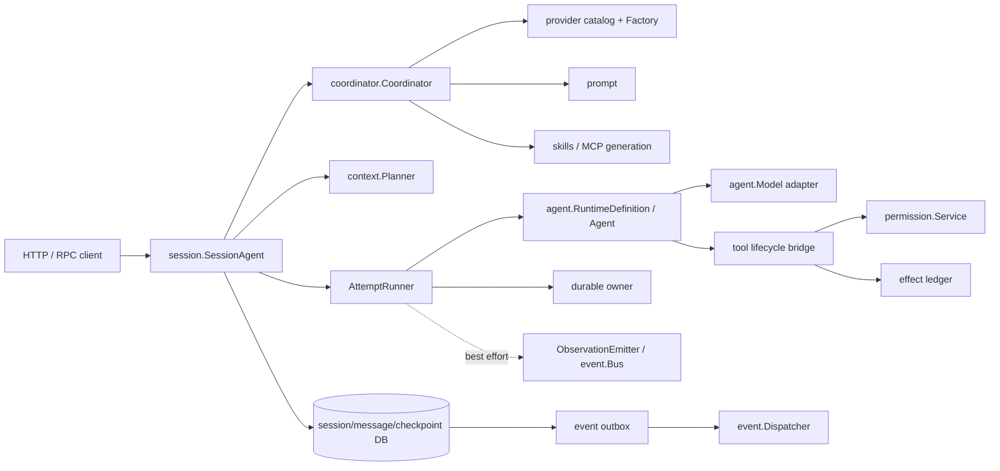

# 生产组合模式

本文面向把本库组合成生产服务的架构与后端开发者，给出推荐拓扑、一个有代表性的组合示例和按主题分组的模式清单。核心原则：仓库是一组边界清晰的 ports，不是自动提供 exactly-once、权限和事务的黑盒——根包负责确定性的 model/tool 循环；应用负责 tenant、generation、session、durable ownership、数据库事务、provider credential 和外部副作用。

## 推荐拓扑



请求路径：

1. API 层验证 tenant、principal、stable request ID，调用 `session.SessionAgent.Run`。
2. session host 解析并固定 runtime generation，创建 branch/admission 和 durable run 初态后才返回 receipt。
3. worker 从固定 session revision 生成 `context.Plan`，按 plan/definition digest 恢复同一执行输入。
4. attempt runner 获取 lease/fence，调用根包 `Agent.Run` 或生产工具 executor。
5. 最终 checkpoint、session/message 投影和 outbox 在 owning 数据库事务中完成。
6. dispatcher 在事务外重试投递；客户端以 authoritative snapshot + replay cursor 对账。

## 代表性组合示例

固定 generation（resolve）、执行 attempt、原子提交终态，是生产路径的三个核心环节：

```go
// 1. 固定 runtime generation：provider/prompt/tools/skills/MCP 全部按值进入 manifest。
maxTokens := 2048
resolved, err := coord.Resolve(ctx, coordinator.ResolveRequest{
	Selector: coordinator.Selector{
		AgentKey:  "support",
		TenantKey: tenant,
		Values:    []coordinator.SelectorValue{{Key: "region", Value: "eu"}},
	},
	ModelRole:  provider.RolePrimary,
	RunOptions: agent.GenerationOptions{MaxTokens: &maxTokens},
})
if err != nil {
	return err
}
if resolved.Definition.ArtifactVersions().Definition != resolved.DefinitionDigest {
	return errors.New("definition digest drift")
}
runner, err := resolved.Definition.NewAgent()
if err != nil {
	return err
}

// 2. 执行 attempt（lease/fence 由 durable owner 管理）。
result, err := runner.Run(ctx, request)
if err != nil {
	return classifyAttemptFailure(err, result)
}

// 3. AutoComplete=false 时 DurableCompletion 是"完成授权"，不是"已完成"。
//    checkpoint 完成、消息投影、session 推进和 outbox 必须在同一领域事务中提交。
//    以下 *InTransaction 是应用 adapter 提供的事务 helper，不是 SDK 现有符号。
if result.Outcome == agent.OutcomeCompleted && result.DurableCompletion != nil {
	return db.WithTx(ctx, func(tx Tx) error {
		if err := checkpoints.CompleteInTransaction(tx, *result.DurableCompletion); err != nil {
			return err
		}
		if err := messages.ProjectRunInTransaction(tx, result); err != nil {
			return err
		}
		if err := sessions.FastForwardInTransaction(tx, result); err != nil {
			return err
		}
		return outbox.AppendInTransaction(tx, terminalEvent(result))
	})
}
```

逐个调用接口方法无法跨 owner 自动获得原子性；事务边界必须由应用数据库 adapter 提供。

## 模式清单

### Runtime generation

- 生产恢复用 `provider -> coordinator -> RuntimeDefinition`，不用裸 `agent.New`。
- catalog 固定 provider/model/version/capabilities/defaults/pricing version；prompt 固定 template version；tool set 固定 definition、replay policy 和 executable version digest；skills/MCP 固定 tenant-scoped generation 和 artifact digest。
- manifest 只存 values，不存 interface 或 Go 函数；`ExecutionSettings.StopConditions` 是函数，进不了 manifest——自定义停止条件应注册在应用的 versioned registry，以 `PolicyVersion` 精确重建。
- resume 使用 `ResolveGeneration`，绝不用当前 generation 冒充历史 generation。

### 存储与事务不变量

事务边界跟随业务不变量，不按 package 名机械拆库：

- admission 与 durable begin 一起成功，避免"已排队但不可恢复"。
- tool effect 的 prepared/running/result 与 run fence 由同一权威 owner 校验。
- completed checkpoint 与 session/message 最终投影原子提交。
- terminal event 与聚合变更在同一事务写 outbox。
- permission ask 与 run suspension/blocker 原子关联。

一个物理 PostgreSQL adapter 可同时实现多个 port，但每个写入口有唯一 owner。分别调用 `session.Memory`、`message.Memory` 和 `event.MemoryStore` 不构成事务。

### Provider adapter

- adapter 实现根包 `agent.Model`：保持 part 顺序、传完整工具 schema 和显式 tool choice、拼接上游 tool argument delta（只有完整调用才发 `ChunkToolCall`）、发送一个且仅一个 `ChunkFinish` 后关闭 channel。
- terminal `Response.Message` 必须与已发增量完全相等；usage 归一化并保留 cache/reasoning 分类。
- 用 `NewModelError` 分类 rejected/auth/rate-limit/transport/protocol；detail 不泄漏 credential 或敏感 payload；cancellation 必须取消 HTTP request/stream reader，不遗留 goroutine。
- 上线门槛：通过 `agenttest.TestModel` conformance 测试。
- 不要根据上游实际返回动态修改 `Capabilities()`；capability 是 generation identity 的一部分，漂移必须发布新 catalog generation。

### 工具与权限

- 两个层次：根包 `agent.ToolSet` 是模型工具循环和 schema 边界；子包 `tool.Executor` 是副作用边界（interceptor、canonical input、permission、fence、ledger）。
- 两种模式二选一，不能让两套 ledger 同时声称拥有同一 effect：简单模式直接执行 `agent.Tool` + 根包 `CheckpointStore`；完整模式由 attempt runner 驱动 `tool.Executor`，`tool.ExecutionLedger` 适配到唯一 durable effect owner（适合审批、rewrite、审计）。
- 权限必须针对 rewrite 后的 `PreparedExecution`；`tool.Executor` 顺序：prepare -> preflight/rewrite -> freeze/digest -> ledger prepare -> authorize -> ledger begin -> execute -> complete。
- `permission.FenceValidator` 刻意不 import `durable`；应用 adapter 把 permission 的 opaque refs 映射到 durable owner 并比较当前 attempt/fence，不匹配返回 `permission.ErrStaleFence`。
- `ReplayPolicyIdempotent` 只在下游真正按相同 execution key 去重时成立；cancellation、panic、网络写后断开、effect 已发生但 ledger complete 失败都归类 unknown；unknown 不自动重放，可查询外部状态时实现 resolve/reconcile；permission deny 可安全记 failed（effect 尚未越过 `ledger.Begin`）。

### 事件可靠性

| 类型 | 通道 | 保证 |
|---|---|---|
| token/tool/step observation | `ObservationEmitter` / `event.Bus` | 有界、非阻塞、可丢；仅 UI/指标 |
| session snapshot event | `event.Store` | 持久化、at-least-once delivery |
| terminal/domain event | 业务事务内 outbox | 与聚合原子、at-least-once delivery |

- `AppendBatch` 在 owning aggregate transaction 内执行；dispatcher 只 claim/publish/ack/nack，不重新推导业务事件。
- consumer 按 `EventID` 持久化去重，并与业务写在同一事务；SDK `event.Inbox` 是进程内参考，重启后失忆。
- replay 返回 `Gap` 或 `Reset` 时，先取 authoritative cumulative snapshot 再从 cursor 继续，不能忽略缺口。

### Durable 选型与 lease/fence

- 两套 durable：`agent.CheckpointStore` 贴近 `Agent.Run`，适合嵌入式直接恢复；`durable.Store + ExecutionLedger + UsageLedger` 面向 session/app 宿主，提供 scan、renew/release/revoke 和 reconcile。服务化系统通常选子包 `durable` 为权威 owner，由 `AttemptRunner` 适配根包执行。
- 同时使用时必须规定：谁分配 fence/revision、哪个 effect ledger 是唯一事实来源、根包 guard 如何映射、终态如何与 session/messages/outbox 原子提交。
- lease expiry 只允许新 worker acquire，不授权旧 worker 继续写；每次 acquire/revoke 推进 fence；DB 条件更新影响 0 行时返回 conflict 并 reload。
- model inflight 崩溃会重复模型调用；running tool 被 revoke 时标 unknown，除非已证明可按 execution key 安全重放。
- shutdown 顺序：先关 admission，再 drain/cancel/checkpoint/revoke/wait，最后 flush events、close components。

### Session 与 Context

- `session.SessionAgent` 是长期请求入口：`Run` 持久化 receipt 后 worker 独立推进，不把 HTTP context 传到后台 attempt。
- 每个 run 固定：tenant key、stable request ID、session base revision、branch key/version、definition/manifest digest、context plan key/digest、tokenizer ID、预算、step policy digest、durable input/config digest。
- `context.Plan` 是固定 revision 的 provider 输入；执行期间 session 新增消息由 branch merge 处理，当前 attempt 不偷读。tool call/result exchange 成组保留，压缩不截断半个 exchange。
- `message.Snapshot` 是累计值，streaming 保存用 expected revision + attempt + fence 并完整替换 parts；对外展示以 `ListVisible(session revision)` 或 authoritative snapshot 为准，不用 observation delta 拼权威消息。

### MCP、Skills 与 Subagent

- MCP generation 是 live connection generation：run 开始时取 lease，把 generation/artifact identity 写入 manifest；进程重启的 exact restoration 需要应用重建同一配置和能力。MCP 工具结果做大小限制、内容类型过滤和敏感数据处理；descriptor 转成 `agent.ToolDefinition` 不等于获得权限，仍需纳入 tool/permission 层。
- skill instructions 永远是不可信输入；`ToolRequirements` 仅用于能力校验，不自动扩大 `ToolSet` 或 grant；审计记录 descriptor/content digest。
- child run 独立 run/attempt/fence 和预算；spawn 的 relationship、父 blocker、预算 reservation 在一个事务中；child terminal 先提交 wake intent 再异步幂等唤醒 parent；父取消有遍历上限。

### 测试策略

- 合约测试：每个 provider adapter 跑 `agenttest.TestModel`，每个工具跑 `agenttest.TestTool`；数据库 adapter 复用内存实现测试表达的 CAS、deep copy、tenant isolation 和 idempotency 语义；prompt/manifest/plan/snapshot 做 golden digest 和 wire round-trip 测试。
- crash-point 注入至少覆盖：`ModelInflight` 后、`CommitModelResponse` 前、ledger `Begin` 后外部调用前、effect 成功后 `Complete` 前、finalizing 后领域事务前、outbox publish 后 ack 前、ask 保存后 suspend 投影前、child terminal 后 parent wake 前。断言不是"仅调用一次"，而是状态符合协议：安全步骤可重试，模糊 effect 进入 unknown，重复 event/usage/request 不产生重复领域效果。
- 并发隔离：两 worker 争抢同一 run 只有一个 fence 可写；lease 过期后旧 worker 每个 mutation 都失败；同一 session 两个 branch fast-forward 只有一个成功；同一 execution key 并发只有一个越过 effect boundary；tenant 之间同名 key 不交叉。
- 仓库验证：`go test ./... -count=1` 与 `go vet ./...`；真实 adapter 加 `-race`、integration 和故障注入，验证真实隔离级别和唯一约束。

## 上线检查表

- **Artifact**：固定 Go module version；每个 run 保存 definition/manifest/model/prompt/policy/tool/skills/MCP/tokenizer 的 generation 或 digest；恢复只按 exact generation；durable tool 声明非空 executable version。
- **Provider**：通过 conformance 与真实 cancellation/timeout 测试；流有唯一 terminal 且与增量一致；retry 只针对 `ModelError.Retryable` 并尊重 `RetryAfter`；日志不含 API key 或敏感 prompt。
- **Tool/Permission**：每个工具声明 effect class、replay/idempotency、timeout、输入输出限制和 concurrency；permission 在 rewrite 后执行；ask/resolve/resume 绑定 tenant、attempt、fence、input digest、policy 和 tool generation；unknown effect 有 reconcile 队列；sandbox 是应用责任。
- **State/Durable**：所有 persisted operation 带 tenant scope；admission+begin、completion+projection+outbox、approval+suspension 满足原子性；guard 在同一 SQL statement 比较 owner/revision/fence；lease renew、revoke、scan worker 已部署并有告警；未知 snapshot schema 拒绝恢复。
- **Event**：可靠事件走 outbox；consumer/webhook 按 EventID 幂等；dead-letter、lease age、replay gap 有监控；shutdown 先 settle producer 再 flush outbox。
- **容量**：admission 有 global/tenant/session 上限；context budget 用准确 tokenizer 并计入 tool schema/media/reserved output；suspended、merge-pending、unknown、approval-pending 都有恢复入口和 SLA；subagent depth/fanout/token/cost 全部有限。
- **发布回滚**：不兼容 schema 先迁移再发布；旧 generation 在所有 pin 释放前不可删除；回滚 binary 加载不了 snapshot 时停止 admission 而不是猜测执行；shutdown budget 与平台 termination grace period 对齐。

生产目标不是声称 exactly-once，而是让每个模糊窗口都有明确状态、稳定身份、可证明的重试规则和可操作的恢复路径。运行循环协议细节见 [internals.md](internals.md)，各子包接入边界见 `packages/` 下对应文档（如 [packages/durable.md](packages/durable.md)、[packages/permission.md](packages/permission.md)、[packages/event.md](packages/event.md)）。
